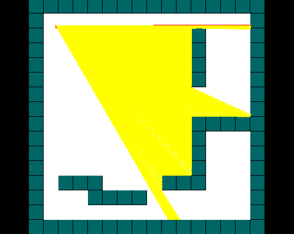

# Raycaster-SDL
Just a simple raycaster using SDL and c.

## Overview
I made this project because I want to knew how raycaster works and to see how SDL works. I'm not that good in c, so if you would like to clone the code and make some pull request, I would be so glad. (even if was just to correct my poor grammar in english, or change the variables/functions names to better names).

## Requirements
This project requires the following libraries:
<ul>
	<li>SDL2</li>
</ul>

## Compiling
Just run a `make`, or if you like to type the command:

`gcc main.c -lm -lSDL2 -o main`

## Run
run ./main after compiling

## Construction
I'll probably come back here later to improve the cod :)

