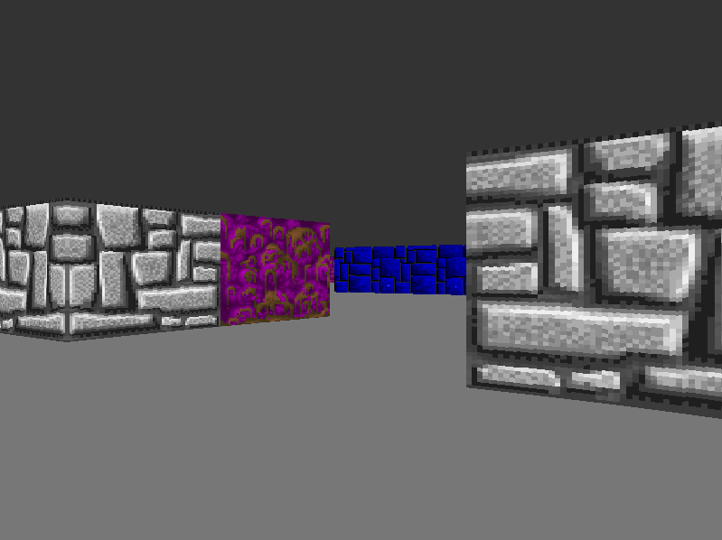

# Raycaster-SDL
Just a simple raycaster using SDL and c.

## Overview
I created this project because I wanted to understand how raycasters work and explore the functionalities of SDL. My C skills aren't top-notch, so if you feel like cloning the repo and making a pull request, I'd really appreciate it. It could be as simple as fixing my grammar in English or refining the names of variables and functions. Thanks a bunch!

## Requirements
This project requires the following libraries:
<ul>
	<li>SDL2</li>
</ul>

## Compiling
Just run a `make`(or `mingw32-make build` if you are in windows), or if you like to type the command:

`gcc -Wall -Wextra -Wpedantic -std=c99 -O2 ./src/*.c -lm -lSDL2 -o raycast`

## Run
run `./raycast` (or `./raycast.exe` if you are in windows) after compiling

## Using 

`Up`        move forward 
`Down`      move backward 
`Left`      turn left 
`Right`     turn right 
`LShift`    open map 

## Construction
I'll probably come back here later to improve the code :)

